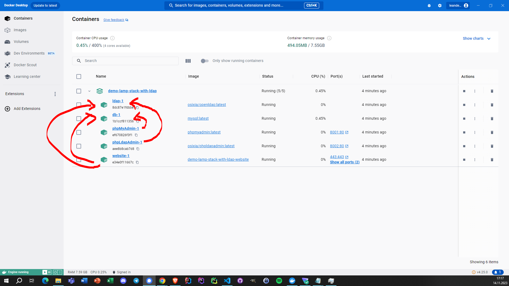
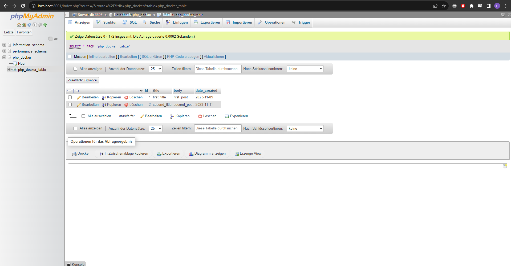
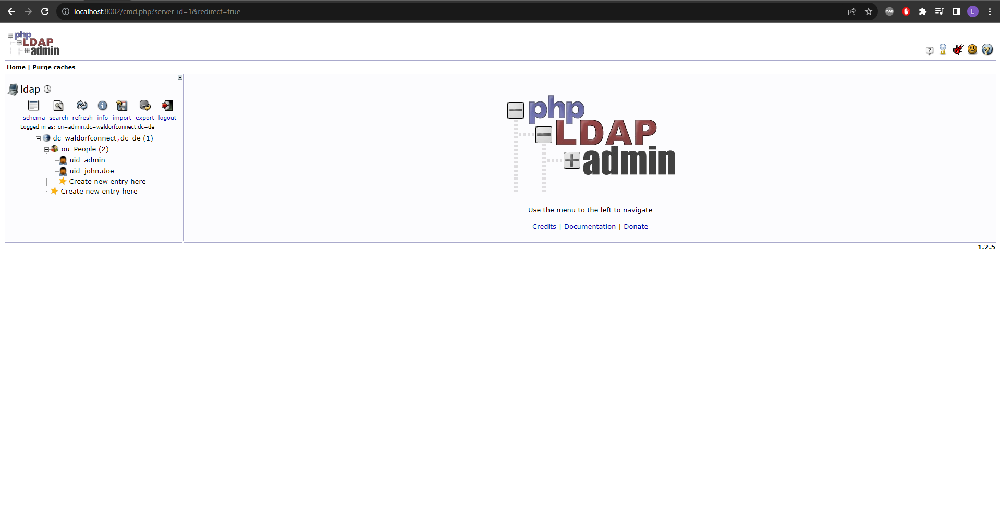
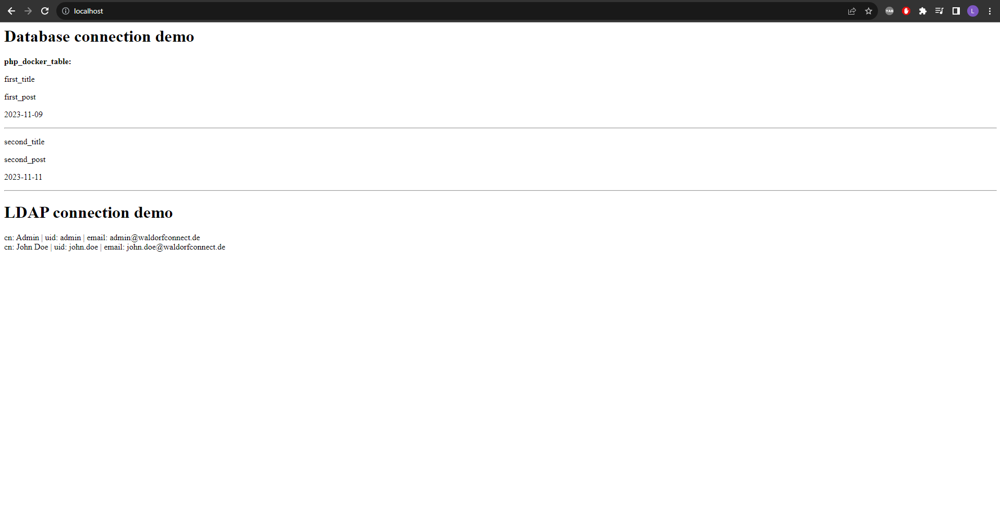

# Demo LAMP Stack with LDAP

This project demonstrates how to setup an application using the LAMP Stack (Linux, Apache, MySQL, PHP) and a LDAP Server using Docker Compose.

### Requirements:

- Docker

### Recommendations:

- Docker Desktop (includes Docker)

 

## Start, stop and destroy it

### Run it:

- execute `docker compose up` in the terminal

### Stop it and destroy it:

- press `Ctrl + C` in the terminal
- execute `docker compose down` in the terminal

 

## Look at it

### Administer the databse with phpMyAdmin:

- localhost:8001
  - username: php_docker
  - password: password

### Administer the LDAP server with phpLdapAdmin:

- localhost:8002
  - Login DN: cn=admin,dc=waldorfconnect,dc=de
  - password: password

### Pages of the PHP application:

- localhost or localhost:80 or localhost/index.php
- localhost/test.php

## Screenshots

<u>5 Containers:</u>

- MySQL database
- phpMyAdmin
  - accesses and depends on the database
- LDAP server
- phpLdapAdmin
  - accesses and depends on the LDAP server
- website
  - accesses and depends on the database and the LDAP server

 

 

 

